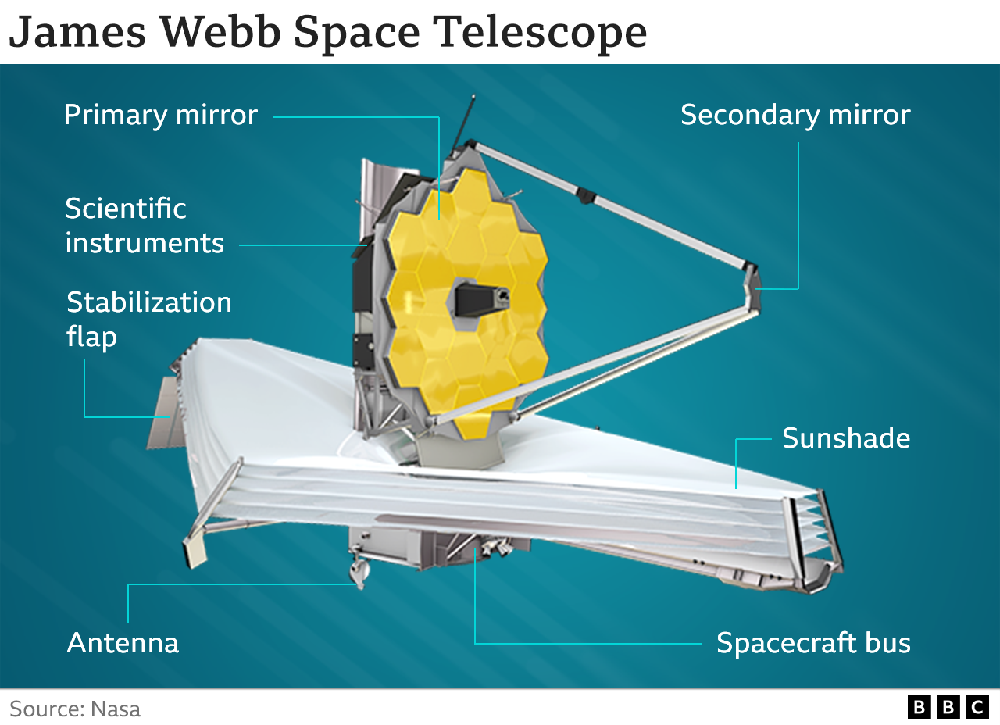
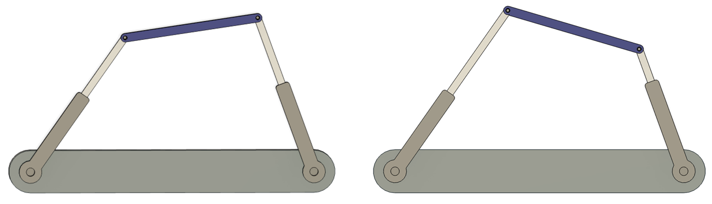
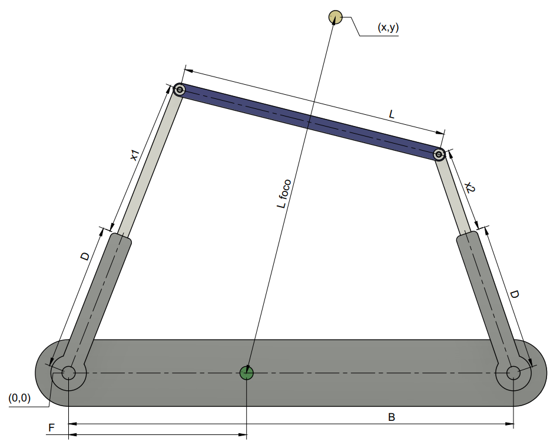

# Descripción

El telescopio James Webb usa un mecanismo basado en pistones lineales que permiten ajustar la orientación de un espejo secundario.

Para este proyecto asumiremos una geometría simplificada de este mecanismo. Considere un telescopio con un espejo secundario de forma rectangular de largo $L$. El espejo secundario se orienta a través de dos pistones que se encuentran en los extremos del espejo y ajustados a una base fija en el espejo principal de separación $B$. Cada pistón puede extenderse o contraerse de manera independiente. La extensión de cada pistón $x_i$ está entre los límites $D\leq x \leq  d_{max}$.
En el espejo principal existe un punto de foco ubicado a una distancia $F$ del extremo izquierdo. 
El espejo secundario debe ser orientado de tal manera que la luz del punto $P(x,y)$ debe atravesar en línea recta el punto medio del espejo secundario al punto de foco ubicado en el espejo principal. 

# Objetivo
Determine la distancia de cada uno de los pistones $x_1,x_2$ para enfocar el telescopio a un punto $P(x,y)$.
Recuerde que el espejo secundario debe ser perpendicular a la dirección del punto $P$.

Realice una interfraz gráfica que muestre la orientación del espejo secundario y permita ingresar los parámetros de entrada.
## Párametros de entrada
* $L$: Largo del espejo.
* $B$: Separación entre los pistones.
* $D$: Longitud mínima de los pistones.
* $d_{max}$: Longitud máxima de los pistones.
* $P(x,y)$: Coordenadas del punto en el espacio.
* $F$ Distancia del foco al extremo izquierdo del espejo principal.

## Párametros de salida
* $x_1$: Longitud del pistón 1.
* $x_2$: Longitud del pistón 2.

## Aclaraciones
* En caso de existir múltiples soluciones, establecer $x_1$ y $x_2$ para que tengan la máxima extensión posible.
* En caso de no existir solución, establecer $x_1$ y $x_2$ para que se acerque lo más posible sin quebrantar los límites físicos.